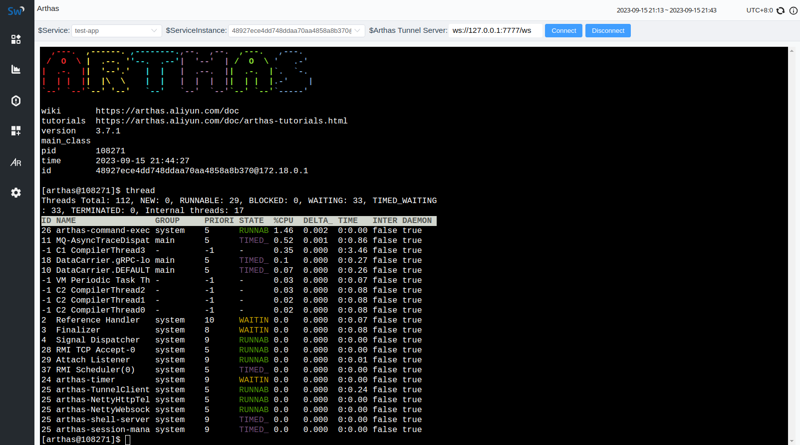
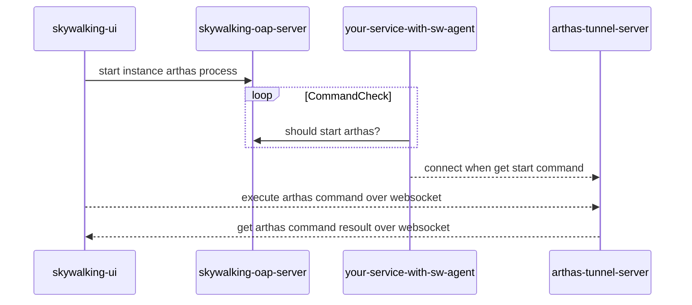
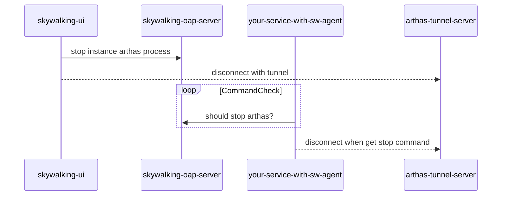

# skywalking-x-arthas
Start an arthas diagnostic process from [skywalking-ui](https://github.com/apache/skywalking-booster-ui), without ask access of server from your boss.

Package arthas into [skywalking-agent](https://github.com/apache/skywalking-agent), without copy installation package to vm or container when troubleshooting.


## Quick Start
### 1. git clone skywalking-x-arthas
```
git clone https://github.com/weixiang1862/skywalking-x-arthas
```
### 2. copy arthas-control-plugin to your agent `plugins` folder
```
cd ${path_to_skywalking-x-arthas}
cp dist/arthas-control-plugin-9.1.0-SNAPSHOT.jar ${your_sw_agent_home}/plugins/

cat << EOF >>${your_sw_agent_home}/config/agent.config
> # arthas home, default is {$AGENT_HOME}/arthas
> plugin.arthas.arthas_home=${SW_ARTHAS_HOME:}
> # arthas tunnel server address, (e.g. ws://127.0.0.1:7777/ws)
> plugin.arthas.tunnel_server=${SW_ARTHAS_TUNNEL_SERVER:ws://127.0.0.1:7777/ws}
> plugin.arthas.session_timeout=${SW_ARTHAS_SESSION_TIMEOUT:}
> plugin.arthas.disabled_commands=${SW_ARTHAS_DISABLED_COMMAND:}
> EOF
```
### 3. copy arthas-controller to your oap-server `oap-libs` folder
```
cd ${path_to_skywalking-x-arthas}
cp dist/arthas-controller-9.7.0-SNAPSHOT.jar ${your_oap_server_home}/oap-libs/

cat << EOF >>${your_oap_server_home}/config/application.yml
> arthas-controller:
>   selector: default
>   default:
> EOF
```
### 4. copy skywalking-webapp.jar to your oap-server `webapp` folder
```
cd ${path_to_skywalking-x-arthas}
cp dist/skywalking-webapp.jar ${your_oap_server_home}/webapp/
```
### 5. download arthas & start an arthas tunnel server
```
https://arthas.aliyun.com/download/latest_version?mirror=aliyun -O arthas.zip
mkdir ${your_sw_agent_home}/arthas
unzip arthas.zip -d ${your_sw_agent_home}/arthas

wget https://arthas.aliyun.com/download/arthas-tunnel-server/latest_version?mirror=aliyun -O arthas-tunnel-server.jar
java -jar arthas-tunnel-server-3.7.1.jar
```
### 6. restart your service and oap-server then do some test

## How It Works
### 1. connect


### 2. disconnect



## Building From Source
### 1. build skywalking
follow skywalking official [skywalking build docs](https://skywalking.apache.org/docs/main/next/en/guides/how-to-build/).
### 2. build skywalking-agent
follow skywalking official [skywalking-java build docs](https://skywalking.apache.org/docs/skywalking-java/next/en/contribution/compiling/).

## Documentation
To learn more, read the [documentation](./docs/skywalking-x-arthas.md).